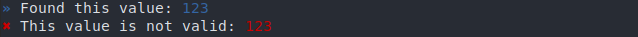
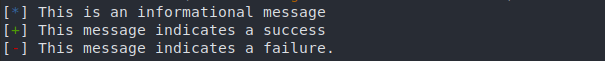
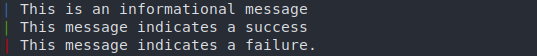

# Input, output, and flow control

Basics for input, output and flow control. Refer to [`tenlib.flow`'s documentation](../tenlib/flow/index.html) for details.

- [Input, output, and flow control](#input-output-and-flow-control)
    - [Input](#input)
        - [Program arguments](#program-arguments)
        - [Argument types](#argument-types)
        - [Optional arguments](#optional-arguments)
        - [Entry class](#entry-class)
        - [Documentation](#documentation)
    - [Output](#output)
        - [Basics](#basics)
        - [Changing the display style](#changing-the-display-style)
    - [Flow control](#flow-control)
        - [Pausing](#pausing)
        - [Exiting early](#exiting-early)
        - [Assumptions](#assumptions)
        - [inform: Status of your functions](#inform-status-of-your-functions)

## Input

Receiving arguments using `sys.argv` or `argparse` can get tedious, especially
when you just want to run a quick program.

### Program arguments

To avoid this, the arguments to the main function are mapped to command-line
arguments automatically.

```python
from ten import *

@entry
def main(a, b):
    print('a:', a)
    print('b:', b)

main()
```

You'd call the program like so:

```
$ ./program.py testA testB
a: testA
b: testB
```

### Argument types

Another annoying thing when fetching arguments is typing: what if I want an
argument to be an integer ? Well, type-hinting is supported.

```python
@entry
def main(a: int, b: int):
    c = a + b
    print(c)
```

You can even use lists:

```python
# Note: list[int] requires py3.10 -- For earlier versions, use typing.List[int]

@entry
def main(all_numbers: list[int]):
    c = sum(all_numbers)
    print(c)
```

```
$ ./program.py 1 2 3 4
10
```

### Optional arguments

If your input argument has a default value, its expected type will be the same
as the default value, and it will become an optional argument.

```python
@entry
def main(some_arg, some_number=3, some_string='test'):
    print('some_arg:', repr(some_arg))
    print('some_number:', repr(some_number))
    print('some_string', repr(some_string))
```

The two last arguments will be optional, as can be seen using the `--help`
command.

```
$ ./program.py -h
usage: program.py [-h] [-s SOME_INT] [-S SOME_STR] some_arg

positional arguments:
  some_arg

optional arguments:
  -h, --help            show this help message and exit
  -s SOME_INT, --some-int SOME_INT
  -S SOME_STR, --some-str SOME_STR
```

Example call:

```
$ ./program.py some_value -s 123
some_arg: 'some_value'
some_number: 123
some_string: 'test'
```

### Entry class

For more complex scripts, you might want to use an object instead of a single function. To do so, apply the `@entry` decorator to the class instead. It'll get instanciated with the program arguments, and its `run()` method will be called.

```python
from ten import *


@entry
class Exploit:
    def __init__(self, url: str, workers: int):
        self.url = url
        self.workers = workers

    def run(self):
        ...


Exploit()
```

Generally, the `__init__` function only sets values from the arguments. Therefore, `@entry` synergizes well with `@dataclass`:

```python
from ten import *
from dataclasses import dataclass

@entry
@dataclass
class Exploit:
    url: str
    workers: int

    def run(self):
        session = ScopedSession(url, workers)
        ...

Exploit()
```

### Documentation

Entrypoint arguments can be documented using the `@arg` decorator.

```python
@entry
@arg("url", "Target URL")
@arg("proxy", "Proxy URL")
@arg("max_connections", "Maximum number of connections")
def main(url, proxy=None, max_connections=10):
    """CLI documentation for the program.
    """
```

The `--help` command will display the documentation:

```shell
/tmp/l1 --help
Usage: l1 [-h] [-p PROXY] [-m MAX_CONNECTIONS] url

CLI documentation for the program.

Positional Arguments:
  url                   Target URL

Options:
  -h, --help            show this help message and exit
  -p, --proxy PROXY     Proxy URL
  -m, --max-connections MAX_CONNECTIONS
                        Maximum number of connections
```

## Output

Spamming `print`s works, but it can get hard to read. Use the `msg_*` functions to display easy to read, identifiable messages.

### Basics


```python
msg_info('This is an informational message')
msg_success('This message indicates a success')
...
msg_failure('This message indicates a failure.')
```

This displays the line with a prefix:


Ten's output is handled by [`rich` library](https://rich.readthedocs.io/), so you can use its built-in style edition features.

```python
msg_info(f'Found this value: [blue]{value}[/]')
msg_failure(f'This value is not valid: [red b]{value}[/]'')
```



### Changing the display style

A few other output styles were implemented. Use `set_message_formatter()` to
set the style you prefer:

```python
set_message_formatter("Oldschool")
# OR ...
set_message_formatter("Slick") # personal favourite
```

those two would yield:





## Flow control

### Pausing

You can pause execution at any time using `pause()`.

### Exiting early

Oftentimes in exploits, you want to display a message, then exit, because
something didn't go as planned.

You can do it in one line using:

```python
leave('Exploit done, exiting.')
```

If the reason for the early exit is a failure or an error, you can use the
eponym functions:

```python
# We want ints only ! a stack trace will be displayed.
if not instance(value, int):
    error('Value should be of type int: {!r}', value)

# Cannot exploit with value < 0. Exits, but no stack trace displayed
if value < 0:
    failure('Value is inferior to zero, unexploitable.')
```

### Assumptions

The same as the `assert` builtin, but the message gets displayed using `msg_failure()`, and no stack trace is displayed.

```python
assume(value >= 0, f'Value is inferior to zero: {value}')
```

### inform: Status of your functions

Say you have a slow function in your code. You'd generally end up with something
like this:

```python
def slow_func():
    print('Starting slow_func, might be slow...')

    # Actually getting stuff done
    ...

    if result:
        print('Result OK !')
    else:
        print('Result not OK !')

    return result
```

With `inform`, you can let **ten** handle the output. `go` gets displayed along with a spinner while the function is running. Then, a different message gets displayed in function of the result.

```python
@inform(
    go="Starting slow_func, might be slow...",
    ok="Result OK !",
    ko="Result not OK !",
)
def slow_func():
    # Actually getting stuff done
    ...
```

Use the `{result}` format to incorporate the result in the success/failure message:

```python
@inform(
    "Counting links in page...",
    "Found {result} links in page",
    "No links were found.",
)
def count_links(url):
    r = session.get(url)
    links = r.select("a")
    return len(links)
```

For single-function programs, you can combine it with `@entry`:

```python
@entry
@inform("Downloading sources...", "Downloaded {result} source files.")
def main(url):
    ...


main()
```